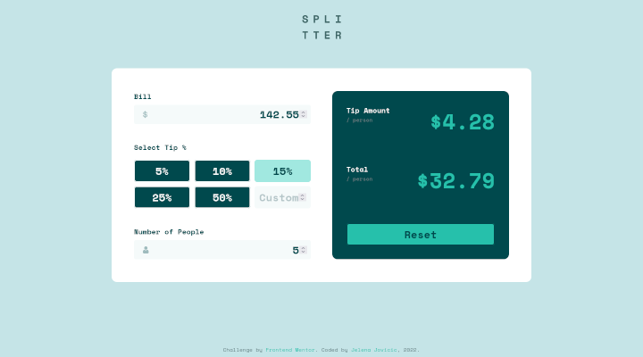

# Frontend Mentor - Tip calculator app solution

This is a solution to the [Tip calculator app challenge on Frontend Mentor](https://www.frontendmentor.io/challenges/tip-calculator-app-ugJNGbJUX). Frontend Mentor challenges help you improve your coding skills by building realistic projects.

## Table of contents

- [Overview](#overview)
  - [Description](#description)
  - [Screenshot](#screenshot)
  - [Links](#links)
- [My process](#my-process)
  - [Built with](#built-with)
  - [Observations](#observations)
  - [Useful resources](#useful-resources)
- [Author](#author)

## Overview

### Description

Users should be able to:

- View the optimal layout for the app depending on their device's screen size
- See hover states for all interactive elements on the page
- Calculate the correct tip and total cost of the bill per person

Updates live as values are entered. Number of persons is assumed to be 1, unless other number is entered.

Reset button is disabled until at least one value is entered.

### Screenshot

### Links

- [FEM Solution](...)
- [Live Site URL](https://je-jo.github.io/tip-calculator-app/)

## My process

### Built with

- Semantic HTML5 markup
- CSS custom properties
- CSS Grid
- Flexbox
- Mobile-first workflow
- JavaScript

### Observations

- radio buttons masked as buttons
- radio buttons focus?

### Useful resources

- [My Basic Template](https://github.com/je-jo/basic-template) pretty much based on Stephanie Eckless' [HTML / Sass Jumpstart](https://github.com/5t3ph/html-sass-jumpstart) but much simpler;
- [Custom CSS Styles for Form Inputs and Textareas](https://moderncss.dev/custom-css-styles-for-form-inputs-and-textareas/)
- [Pure CSS Custom Styled Radio Buttons](https://moderncss.dev/pure-css-custom-styled-radio-buttons/)
- [Customize Radio Button Appearance with CSS](https://markheath.net/post/customize-radio-button-css)

## Author

- [Github](https://github.com/je-jo)
- [Frontend Mentor](https://www.frontendmentor.io/profile/je-jo)
- [Codepen](https://codepen.io/je-jo)
- [Twitter](https://twitter.com/jelena_jo_)